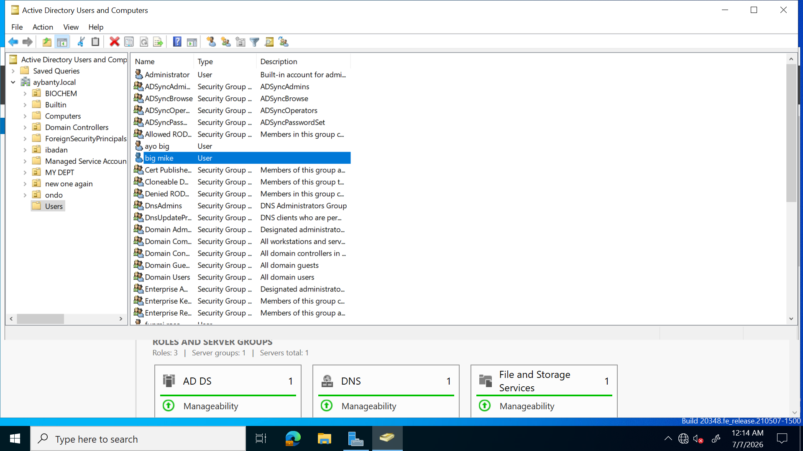
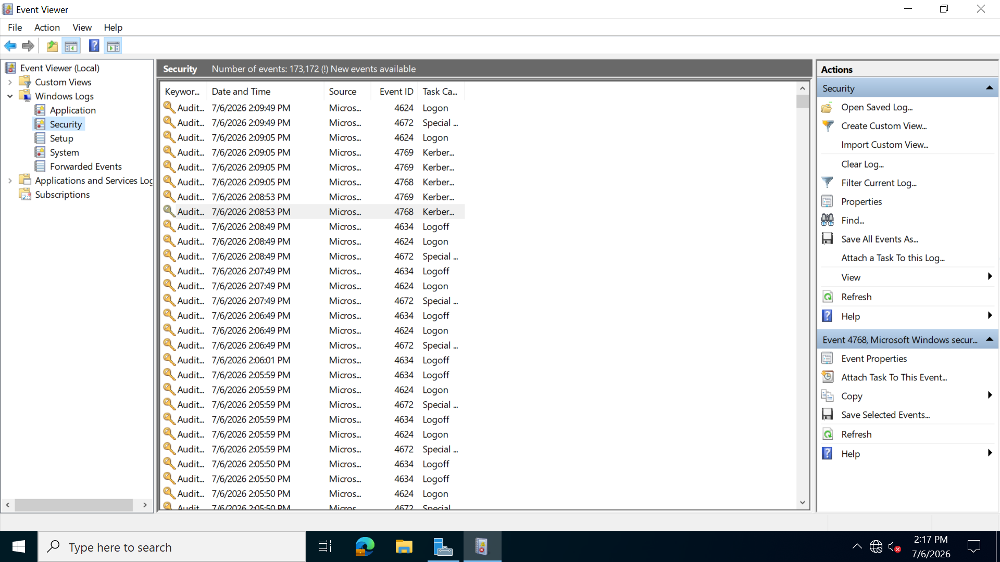
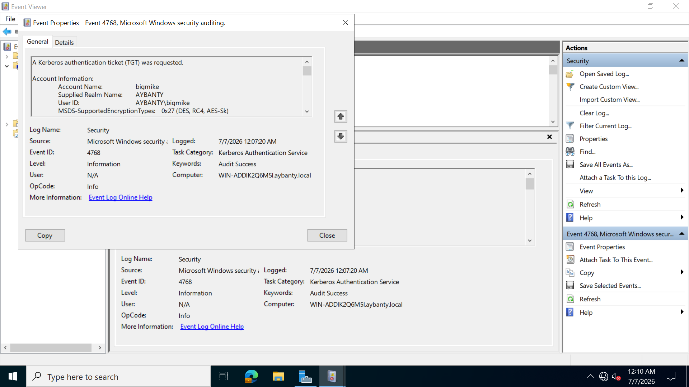

The AS confirms the user is making an access request and issues ticket granting tickets.
When a user logs on to the computer, the AS handles the initial login. when a user in the active directory users and computer tries to login, it checks if the user is in the list of users in the KDC and if so grants ticket granting ticket (TGT).  
I will be using a user from the list and shows the AS issues the TGT which i can view in the eventviewer by pressing window +R and entering  eventvwr.msc and press enter , then i click on window logs , click on security to find a lot of events,  i enter 4768 at the find bar.4768 is the specific window event id that means a keberos authentication ticket (TGT) was requested.  
**User login and the the TGT issued**

 i am going to login with the user big mike and show the Tgt issued. big mike is in the list of active directory and users 

so i used the klist command on my command prompt to get out the TGT and this is it .The tickets contains most of the information that need to be passed such as the client id, session key, time stamps e.t.c
.png>)