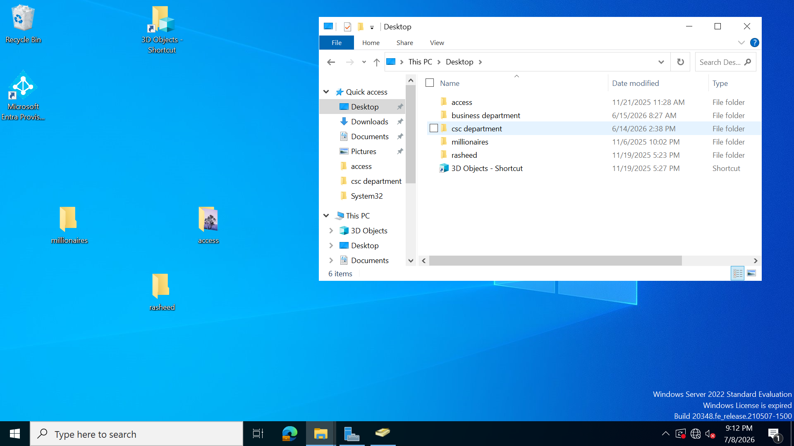
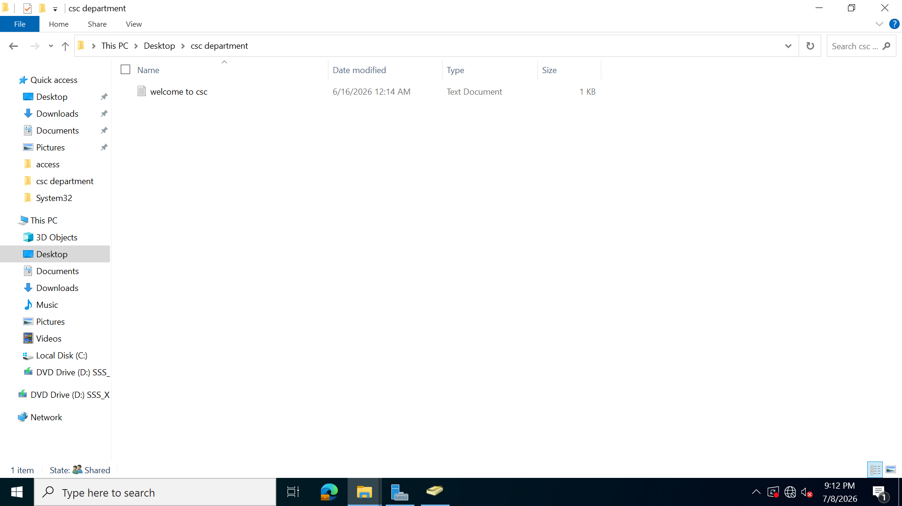
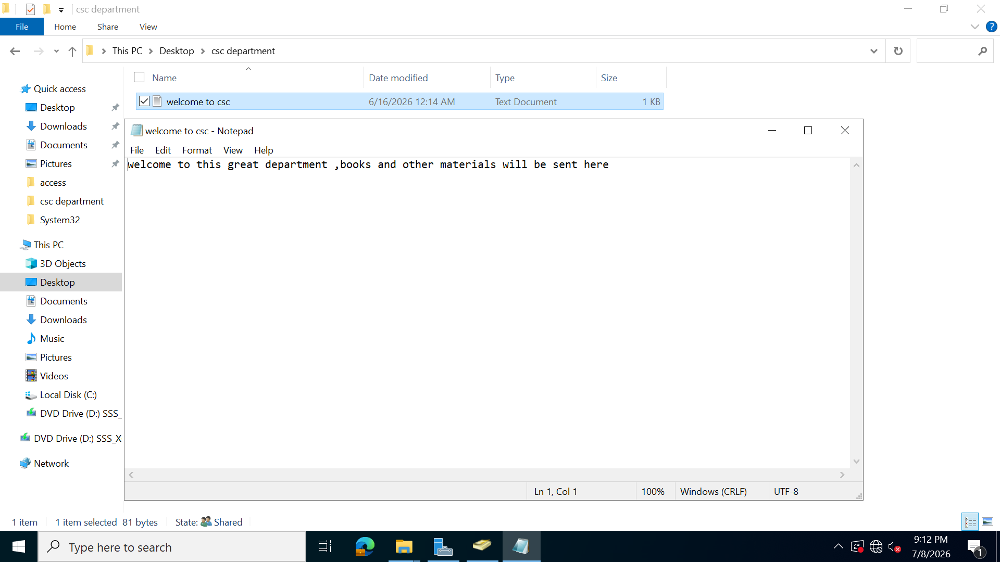

TGS confirms that a user is completing an access request to a known service and issues service tickets.The TGS handles resource access . it takes the TGT and hands specific service tickets for file share , database or printers

**I demonstrated how  a user is goint to access a shared folder and how service tickets will be issued.  i used big mike user to login**

  The name of the folder is a Csc Department folder which has been given permission to be accessed by the csc department group in which big mike is part of.

we accessed the content inside the folder.

i copied the shared file folder and used big mike to access it to see the tickets generated.  

Here big mike user was logged into and was used to access the shared folder 
.png>)
.png>)
The TGT releases a service ticket which contains some attributes after accessing a service. big mike accessed a shared folder. The shared access folder is the service. The service ticket is sent to the service for authorization and access to the folder. By using the Klist command, three  tickets were shown,but the service ticket is the one mapped with CIFS in the server of the ticket. The cifs is a network protocol that windows computer uses to share file,folders and printer over a network.its only the service tickets that contains a resource protocol name like CIFS.
.png>)
.png>)